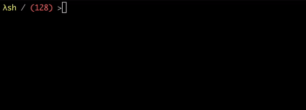

```
   __                 _         _             _
  / /  __ _ _ __ ___ | |__   __| | __ _   ___| |__
 / /  / _` | '_ ` _ \| '_ \ / _` |/ _` | / __| '_ \
/ /__| (_| | | | | | | |_) | (_| | (_| |_\__ \ | | |
\____/\__,_|_| |_| |_|_.__/ \__,_|\__,_(_)___/_| |_|
```

A common shell implementation written in Rust.
This project aims to explore how shells work and implement common shell functionality in Rust.



### ⚠️ **WIP (Work In Progress)**

This shell is currently **not stable** and is intended primarily for **educational purposes**. It may not work as expected, and many features are still in development.

### Features

- Shell customization
- Variables expanding
- Built-in commands (`history`, `export`, `cd`, `alias`, etc.)
- UTF-8, Emojis✨ , Multiline input
- Smart autocomplete
- Persistent history
- Input/output Pipelines
- Input/output redirections
- Comments

#### To be implemented

- Background
- (()) arithmetic expressions
- *,? globs
- foo=bar runtime variables assignment
- ! negate
- [[]] Conditions
- $(),`` Subcommands / Subshells


### Getting Started

To start using lambdash, download the latest release using the release menu.

#### Build from sources

You can run the app simply by cloning the repository and run using cargo build system:

    cargo run

### License

This project is licensed under the MIT License - see the LICENSE file for details.